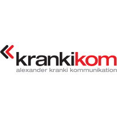
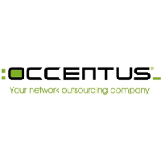
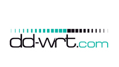
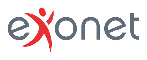
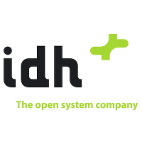
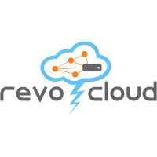
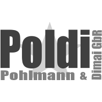
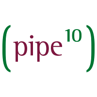
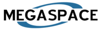

XCP-ng sponsors span all industry sectors. They are trusting open source technologies to help them in their everyday business.

## Platinum sponsors

||||
|---------------------------------------|---------------------------------------|---------------------------------------|
||||

## Gold sponsors

||||
|---------------------------------------|---------------------------------------|---------------------------------------|
||||

## Silver sponsors

||||
|---------------------------------------|---------------------------------------|---------------------------------------|
||||

## Sponsors

||||
|---------------------------------------|---------------------------------------|---------------------------------------|
||||
||||
||
